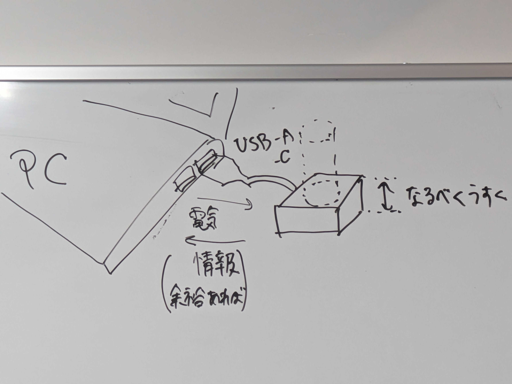
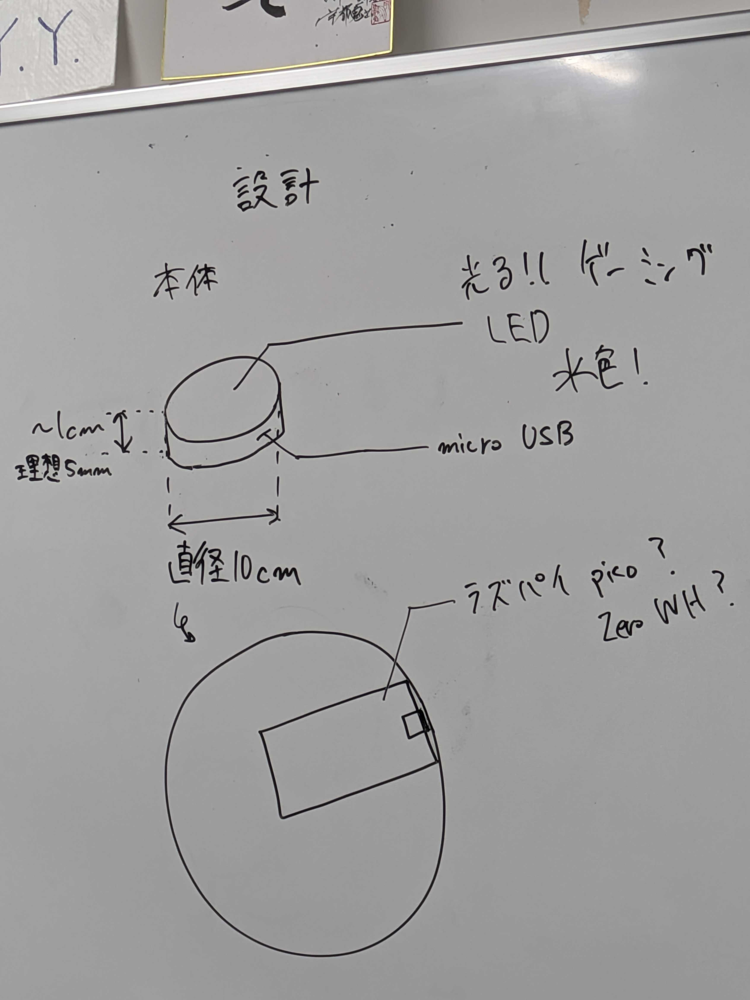
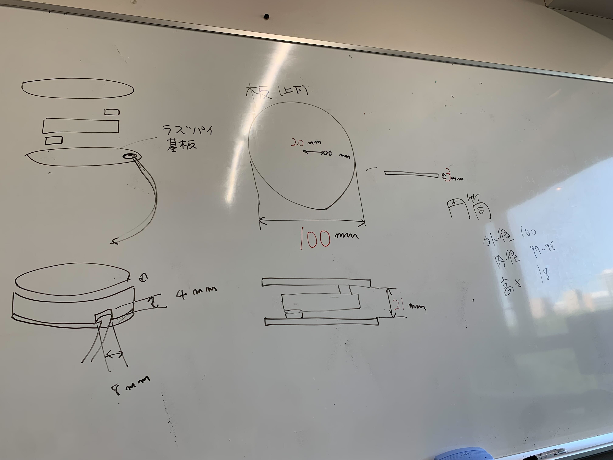

# 4/5
### 目標
- 目標
  - 人の水分摂取量を把握して、お知らせしてくれる機械

- 機能
  - 電源
    - USB-AまたはC,コンセント
  - 水分が入ったタンブラー等、デバイスの上に乗っているものの重量を測る
  - これを元に、中に入っている水分量を計算する
  - 水分量の過不足を評価する
    - 定量的に評価
  -摂取した水分量を反映して、お知らせしてくれる
    - 音声はマスト、できれば画面表示
    - 「〇〇ほど足りていません」

- 実装方法（形を決める、内部の配置）
  - 重量センサ
  - 水分量計算
    - 液体の密度×水分比率
    - 容器の重量は、重量差を把握すればよい
    - 食事から摂取する水分量
      - 事前設定にする：事前にプログラム、標準的な人の生活に合わせる
      - （余裕があれば）起動時に設定：PCのUIで設定
  - 計算で一日の総量
  - 表示方法
    - （余裕があれば）PCで表示するとしたら、デバイスからPCに送る必要あり

- 実装イメージ
  - PCにデバイスを接続（USB-AまたはC）
  - デバイスはなるべく薄く（コースターのように）
  - PC→デバイス：電力
  - デバイス→PC：情報（余裕あれば）

### To do
- 全体
  - 物理設計を作る
    - 重量センサ
    - LED
  - 注文リストを作る
  - 役割分担をする
- 個人
  - 物が必要ない人は作業開始
 
### 役割分担
- ハード
  - 外形
  - 基盤
  - 配線（はんだ付けあるかも） 
- ソフト
  - 液体量計算
  - 人の水分量計算
  - 信号を送る
  - 信号を表示する（PCやる場合PC画面の表示）

# 4/19
- ラズパイを使うというところを重視したい
  - micro USB がついている円筒をイメージ（ここからは電源供給のみでよいものとしたい）
  - 情報はwifiやBluetoothなど、ワイヤレス通信でできるものにしたい

- 買うもの（購入をお願いしたものはリンク添付済み）
  - ラズパイ Pico WH (1340円)
    - https://akizukidenshi.com/catalog/g/g118086/
  - ロードセル＋コンバータ（1398円）
    - https://www.amazon.co.jp/HX711%E3%83%AD%E3%83%BC%E3%83%89%E3%82%BB%E3%83%AB%E3%83%A2%[…]2%AB%E3%82%BF%E3%82%AB%E3%83%8A&dchild=1&s=industrial&sr=1-2
    - https://akizukidenshi.com/catalog/g/g118325/
  - 充電器（microUSB - コンセント）
    - https://amzn.asia/d/6ooeEie
  - 充電ケーブル（microUSB - USB-A）
    - https://amzn.asia/d/fTdL28b
  - 充電ケーブル（microUSB - USB-C）
    - https://amzn.asia/d/c4dxobF
  - 筐体（後で）
  - LEDライト（後で）

### マイルストーン(残り5回)
- 第3回（4/26）
  - PCで重さ取得、配線してみる。
- 第4回（5/10）
  - 水を飲んだ量の計算
  - 筐体デザイン
  - 筐体組み立て
  - LED・ブザーの注文
  - 残りの部品があれば注文
- 第5回（5/15）
  - 警告を出すか判定
- 第6回（5/24） 
- 第7回（5/30）
  - 予備日にしたい
- 第8回（6/7）
  - 発表リハ
- 第9回（6/14）
  - 発表

### To do
- 役割分担？
  - 指示
    - 鎌尾
  -  ハード
    - 山本な、関 
  -  ソフト
    - 山本し、生平

# 4/26
### 今日のやったこと
- 届いたものの動作チェック、配線
  - コンセントに挿す充電器のみ動作チェックまだ
- ラズパイpicoの設定
  - micro pythonを入れて、
  - wifi接続とled点灯成功
- 重量センサと連携して、リアルタイムで重さを測ることができた
- LEDどうする
  - 次回決める
  

# 5/10
### 今日のやったこと
- 筐体
  - LEDライト
    - LEDテープを購入し、USBではなく分解してコードをつなげる。
    - 購入担当：先生にお願い済み
  - 側面のカバー
    - 外径100mm,内径97mmくらい,高さ18mm、（幅8mm,高さ4mmのmicroUSB用の穴）のアクリルパイプをこれから購入
    - 購入担当：山本なおや
      - ホームセンターでパイプ切れるかを聞いてみて、無理なら厚紙的な感じで 
  - 中を隠すためのもの
    - くすみフィルムを買う
    - 購入担当：先生にお願い済み
  - ブザー
    - 購入担当：先生にお願い済み
  - 購入後、組み立て

- 重量計測
  - 水を飲んだ量を計算すること
    - →完了
  - 警告を出すこと
    - 警告表示の基準を次回考える。
    - 警告の方法は

### To do
- ハード
  - 注文した商品の確認
    - 側面の円筒についての結果確認
  - LEDライト（はんだ付け？）
  - フィルム貼る
  - 配線を考える
    - 基盤を固定する
    - ピンへッダの扱い
    - ブザー
- ソフト
  - 警告表示の基準
  - 警告表示の方法

# 5/15
### 今日のやったこと
- ハード
  - 側面のカバーについては、円筒が無理だったので、LEDテープを巻くことでよしとする
  - 導線を組む
    - メモ
      - HX711からラズパイpicoまでの導線9cm
      - LEDからラズパイまでの導線1cm
  - はんだづけ途中
- ソフト
  - 警告表示自体はOK
  - LED点滅
  - wifi接続成功
 
### To do
- ハード
  - はんだ付け
    - LEDの途中から
    - 青と紫のコードを短くして、はんだ付け
  - 基盤を固定する
    - 接着剤？テープ？
  - LEDを巻く
  - フィルムが届いたら貼る
  - できたらブザー
- ソフト
  - 警告表示が実際にペットボトルでできるか確認
  - 警告をPC側で表示する
- ぽゃんがスライドを作る

# 5/24
### 今日やったこと
- ハード
  - はんだ付け成功
  - ブザーがなることを確認した（採用はせず）
- ソフト
  - 全体のテストをして、上手くいくことを確かめた
  - パソコン上で情報を表示するようにした
- スライド
  - イントロ完成
  - アウトラインをほぼ完成（あとは埋めるだけ）
### To do
- ハード
  - 基盤などの接着
  - フィルムを貼る（？）
  - ハードはこれで終わり
- ソフト
  -　警告を表示する
  - グラフを表示する
  - Webデザイン（ぽゃん）
- スライド
  - 発表用の写真の撮影、スライドに貼り付け
