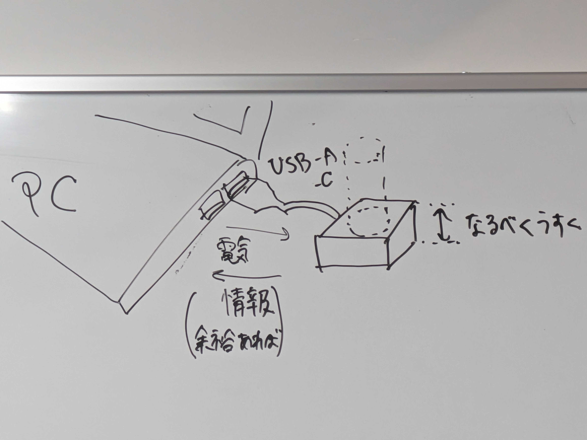

# 4/5
### 目標
- 目標
  - 人の水分摂取量を把握して、お知らせしてくれる機械

- 機能
  - 電源
    - USB-AまたはC,コンセント
  - 水分が入ったタンブラー等、デバイスの上に乗っているものの重量を測る
  - これを元に、中に入っている水分量を計算する
  - 水分量の過不足を評価する
    - 定量的に評価
  -摂取した水分量を反映して、お知らせしてくれる
    - 音声はマスト、できれば画面表示
    - 「〇〇ほど足りていません」

- 実装方法（形を決める、内部の配置）
  - 重量センサ
  - 水分量計算
    - 液体の密度×水分比率
    - 容器の重量は、重量差を把握すればよい
    - 食事から摂取する水分量
      - 事前設定にする：事前にプログラム、標準的な人の生活に合わせる
      - （余裕があれば）起動時に設定：PCのUIで設定
  - 計算で一日の総量
  - 表示方法
    - （余裕があれば）PCで表示するとしたら、デバイスからPCに送る必要あり

- 実装イメージ
  - PCにデバイスを接続（USB-AまたはC）
  - デバイスはなるべく薄く（コースターのように）
  - PC→デバイス：電力
  - デバイス→PC：情報（余裕あれば）

### To do
- 全体
  - 物理設計を作る
    - 重量センサ
    - LED
  - 注文リストを作る
  - 役割分担をする
- 個人
  - 物が必要ない人は作業開始
 
### 役割分担
- ハード
  - 外形
  - 基盤
  - 配線（はんだ付けあるかも） 
-  ソフト
  - 液体量計算
  - 人の水分量計算
  - 信号を送る
  - 信号を表示する（PCやる場合PC画面の表示）

